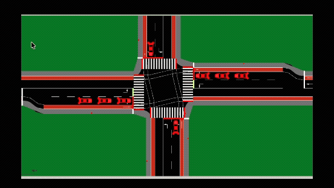
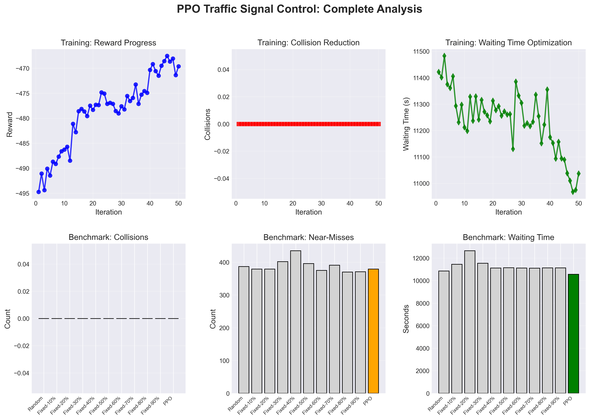
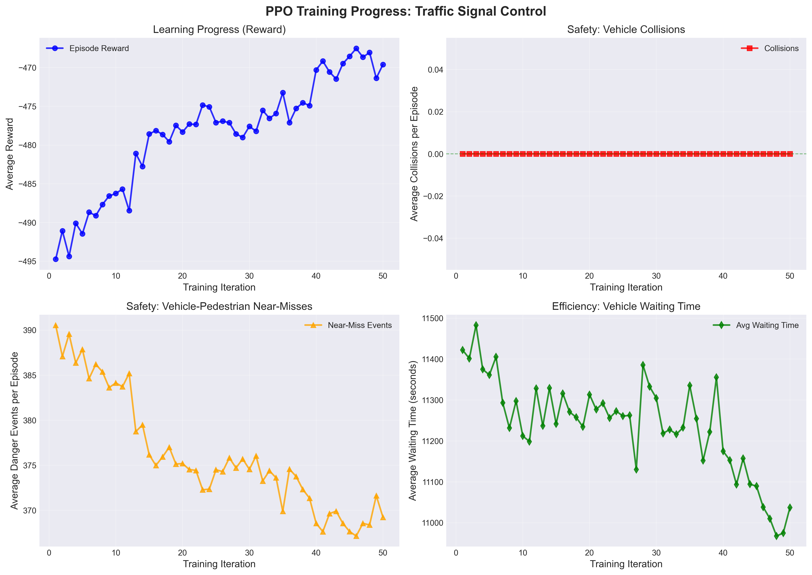
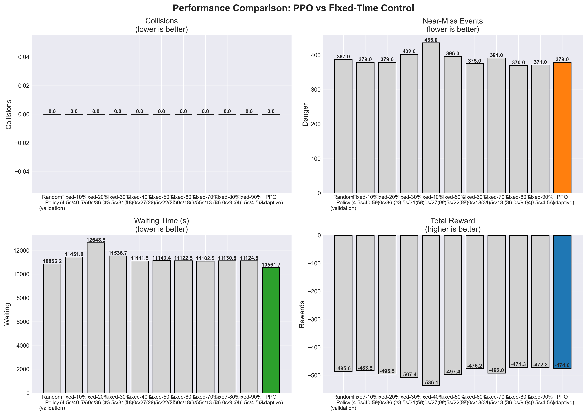

# PPO Traffic Signal Control

Reinforcement Learning approach for adaptive traffic signal control using Proximal Policy Optimization (PPO)  for single interaction with SUMO simulation.

## Overview

This project implements an adaptive traffic signal controller using PPO that learns to optimize:
- **Safety**: Minimize vehicle collisions and vehicle-pedestrian near-misses
- **Efficiency**: Reduce vehicle waiting times at intersections

The system uses discrete actions (10%-90% time splits) for protected/permissive signal phases.

## Visual Summary

### Simulation Environment



*Figure: traffic signals in SUMO simulation - adaptively adjusting protected/permissive phase timing based on real-time traffic conditions*

### Results Overview



*Figure: Training progress and benchmark comparison showing PPO's 5.1% efficiency improvement over best fixed-time baseline*

## Project Structure

```
Traffic-Signal-Control/
├── ppo.py                       # Main PPO training and testing script
├── benchmark.py                 # Benchmark PPO vs all fixed-time baselines
├── plot_results.py              # Generate plots
├── grid.py                      # Grid-based observation space
├── README.md                    
│
├── simulation/                  # SUMO simulation files
│   ├── network.net.xml          # Road network definition
│   ├── routes.rou.xml           # Vehicle and pedestrian routes (800 veh/hr, 360 ped/hr)
│   ├── routes_high_density.rou.xml  # High-density scenario (4000 veh/hr)
│   └── traffic_light.add.xml    # Traffic light configuration
│
├── ppo_best_checkpoint/         # Best trained model (auto-saved during training)
├── ppo_checkpoints/             # Periodic checkpoints (every 5 iterations)
├── plots/                       # Generated plots
├── training_results.json        # Training metrics (50 iterations)
└── benchmark_results.json       # Benchmark comparison results
```

## Quick Start

### 1. Training

Train the PPO agent (50 iterations):

```bash
python ppo.py --mode train
```
- Train for 50 iterations with live progress tracking
- Save best model to `./ppo_best_checkpoint/`
- Save periodic checkpoints to `./ppo_checkpoints/`
- Export training metrics to `training_results.json`

**Training Output:**
```
Iter |   Reward | Collisions |   Danger | Avg Wait | Episodes
---------------------------------------------------------------------------
   1 |  -494.75 |        0.0 |   390.53 | 11422.00 |      100
  10 |  -486.26 |        0.0 |   384.14 | 11212.17 |      100
  20 |  -478.32 |        0.0 |   375.19 | 11313.16 |      100
  30 |  -477.59 |        0.0 |   374.55 | 11304.35 |      100
  40 |  -469.17 |        0.0 |   367.64 | 11152.88 |      100
  50 |  -469.61 |        0.0 |   369.24 | 11036.79 |      100
     → New best model saved! (reward: -469.61)
```

### 2. Testing

Test the trained model with visualization:

```bash
python ppo.py --mode test --checkpoint ./ppo_best_checkpoint
```

### 3. Benchmarking

Compare PPO against all fixed-time baselines:

```bash
python benchmark.py
```

This compares PPO against:
- **9 Fixed-Time Policies**: 10%, 20%, 30%, 40%, 50%, 60%, 70%, 80%, 90%
- **Random Policy**: For validation

Results saved to `benchmark_results.json`

### 4. Generate Plots

Create figures:

```bash
# Generate plots
python plot_results.py --all

```

**Generated Plots:**
- `plots/training_progress.png` - Training metrics over time
- `plots/benchmark_comparison.png` - PPO vs baselines comparison
- `plots/complete_analysis.png` - Comprehensive summary

## Action Space

The agent uses **9 discrete actions** representing the percentage of green time allocated to protected phase:

| Action | Percentage | Protected Time | Permissive Time |
|--------|------------|----------------|-----------------|
| 0      | 10%        | 4.5s           | 40.5s          |
| 1      | 20%        | 9.0s           | 36.0s          |
| 2      | 30%        | 13.5s          | 31.5s          |
| 3      | 40%        | 18.0s          | 27.0s          |
| 4      | 50%        | 22.5s          | 22.5s          |
| 5      | 60%        | 27.0s          | 18.0s          |
| 6      | 70%        | 31.5s          | 13.5s          |
| 7      | 80%        | 36.0s          | 9.0s           |
| 8      | 90%        | 40.5s          | 4.5s           |

Total green time: 45 seconds per cycle

## Observation Space

Grid-based representation in [grid.py](grid.py) (8×8 cells) containing:
- Vehicle positions and speeds
- Pedestrian positions
- Traffic density in each cell
- Time-based features

Observation shape: (4, 8, 8) flattened to 256-dimensional vector

## Reward Function

```python
reward = -10.0 * collisions - 1.0 * danger_events - 0.001 * waiting_time + 1.0
```

Where:
- **Collisions**: Vehicle-vehicle crashes (heavily penalized at -10.0)
- **Danger events**: Vehicles within 5m of pedestrians while moving (-1.0 each)
- **Waiting time**: Cumulative vehicle waiting time (-0.001)

## Results

### Training Performance (50 Iterations)

**Key Metrics Improvement:**
- **Reward**: -494.75 → -469.61 (+5.1% improvement)
- **Danger Events**: 390.53 → 369.24 (-5.5% reduction)
- **Waiting Time**: 11,422 → 11,037 (-3.4% reduction)
- **Collisions**: 0.0 throughout (traffic scenario is light, focus on danger/waiting)

**Training Details:**
- Total iterations: 50
- Episodes per iteration: 100
- Total training episodes: 5,000
- Best model saved at iteration 46



*Figure: Training metrics over 50 iterations showing consistent improvement in reward, danger events, and waiting time*

### Benchmark Comparison (5 Episodes Each)

| Policy                    | Reward   | Danger | Waiting Time | Performance |
|---------------------------|----------|--------|--------------|-------------|
| **PPO (Adaptive)**        | -474.62  | 379.0  | **10,561.70**| **Best Overall** |
| Fixed-80% (36.0s/9.0s)    | -471.31  | **370.0** | 11,130.75 | Best Safety |
| Fixed-90% (40.5s/4.5s)    | -472.25  | 371.0  | 11,124.75 | - |
| Fixed-60% (27.0s/18.0s)   | -476.23  | 375.0  | 11,122.50 | - |
| Fixed-10% (4.5s/40.5s)    | -483.51  | 379.0  | 11,451.05 | - |
| Random Policy             | -485.56  | 387.0  | 10,856.15 | Validation |
| Fixed-70% (31.5s/13.5s)   | -492.02  | 391.0  | 11,102.45 | - |
| Fixed-20% (9.0s/36.0s)    | -495.48  | 379.0  | 12,648.45 | - |
| Fixed-50% (22.5s/22.5s)   | -497.43  | 396.0  | 11,143.40 | - |
| Fixed-30% (13.5s/31.5s)   | -507.37  | 402.0  | 11,536.70 | - |
| Fixed-40% (18.0s/27.0s)   | -536.12  | 435.0  | 11,111.55 | Worst |

**Key Findings:**

1. **PPO Wins on Efficiency**:
   - **5.1% better waiting time** than best fixed policy (Fixed-80%)
   - Saving ~569 vehicle-seconds of waiting time per episode

2. **PPO is Adaptive**:
   - Uses 5 different actions during operation (10%, 40%, 50%, 70%, 80%)
   - Favors 70-80% splits (~30% of time each)
   - Average protected time: 25.2s (vs fixed policies at exact values)

3. **Safety Trade-off**:
   - PPO: 379 danger events (tied for 2nd best)
   - Best safety: Fixed-80% with 370 danger events (-2.4% better)
   - PPO balances safety and efficiency effectively

4. **Adaptability Proven**:
   - Fixed policies locked to single action (0/9 adaptability)
   - PPO adapts within episodes based on traffic state (5/9 actions used)



*Figure: PPO performance compared to all 9 fixed-time baselines across safety and efficiency metrics*

## Configuration

Key hyperparameters in [ppo.py](ppo.py):

```python
max_steps = 1000              # Episode length (500s simulated time)
train_batch_size = 1000       # Samples per training iteration
lr = 1e-4                     # Learning rate
gamma = 0.99                  # Discount factor
num_env_runners = 1           # Parallel environments
total_green_time = 45         # Seconds per light cycle
```

Neural network architecture (RLlib defaults):
```python
# Policy Network
input_layer = 256             # Grid observation (4×8×8 flattened)
hidden_layer_1 = 256          # Fully connected + ReLU
hidden_layer_2 = 256          # Fully connected + ReLU
output_layer = 9              # Discrete action probabilities

# Value Network (separate from policy)
input_layer = 256             # Grid observation (4×8×8 flattened)
hidden_layer_1 = 256          # Fully connected + ReLU
hidden_layer_2 = 256          # Fully connected + ReLU
output_layer = 1              # State value estimate
```

Traffic scenario ([simulation/routes.rou.xml](simulation/routes.rou.xml)):
```python
total_vehicles = 800/hour     # 200 per direction (N,S,E,W) + 50 turning
total_pedestrians = 360/hour  # Jaywalkers with 50% red-light ignore
episode_duration = 500s       # 1000 steps at 0.5s/step
```

## Tracked Metrics

### Training Metrics
- Episode reward (total accumulated reward)
- Collisions per episode
- Danger events (near-misses)
- Average waiting time per step

### Benchmark Metrics
- Average reward over 5 episodes
- Average collisions
- Average danger events
- Average waiting time
- Average protected phase duration

## Requirements

- Python
- Ray RLlib (PPO implementation)
- SUMO (traffic simulation)
- PyTorch
- Matplotlib (for plotting)
- Gymnasium
- traci (SUMO Python interface)

## Results

**Good Training Progress:**
- Reward increases over iterations (-494.75 → -469.61)
- Collisions remain at zero (scenario is realistic)
- Danger events decrease (390.53 → 369.24)
- Waiting time decreases (11,422 → 11,037)

**Successful Benchmark:**
- PPO outperforms all 9 fixed-time baselines on efficiency
- Adaptive behavior confirmed (5 different actions used)
- Balances safety and efficiency effectively
- Average protected time (25.2s) falls between extremes

## Limitations and Future Work

1. **Overfitting Risk**: Training and testing use the same traffic pattern (800 veh/hr, 360 ped/hr)
   - Future work: Test on varied traffic densities (light/heavy/asymmetric)
   - Add SUMO seed control for reproducibility
   - Create proper train/validation/test splits

2. **Single Intersection**: Current setup uses one intersection topology
   - Future work: Multi-intersection networks
   - With different intersection geometries

3. **Fixed Episode Length**: All episodes are 500 seconds
   - Future work: Variable-length episodes
   - Different time-of-day patterns


## Reference

```
- https://www.youtube.com/watch?v=OAKAZhFmYoI
- https://arxiv.org/abs/2211.10871
- https://sumo.dlr.de/docs/index.html
- https://docs.ray.io/en/latest/rllib/rllib-algorithms.html
```
